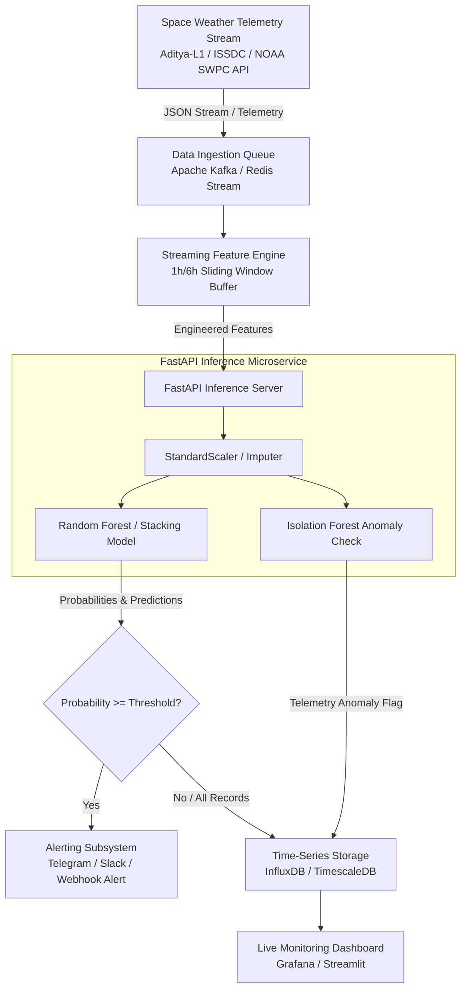

# Real-Time Deployment Architecture: Halo CME Forecasting using Aditya-L1

This guide details the real-time operational architecture, API microservice, streaming telemetry preprocessor, and containerization setup for deploying the CME forecasting model.

---

## 1. System Architecture



---

## 2. Real-Time Pipeline Stack

- **Ingestion**: Apache Kafka / Redis Stream / MQTT
- **Feature Processing**: Python Sliding Buffer (`stream_worker.py`)
- **Inference Service**: FastAPI REST API (`app.py`) running saved model artifacts (`rf_model.pkl`, `scaler.pkl`)
- **Storage**: InfluxDB / TimescaleDB (PostgreSQL)
- **Visualization & Alerting**: Grafana / Streamlit & Webhook triggers (Telegram / Slack)

---

## 3. Key Implementation Code Snippets

### A. FastAPI Inference Microservice (`app.py`)

```python
from fastapi import FastAPI, HTTPException
from pydantic import BaseModel
import joblib
import pandas as pd
import json

app = FastAPI(title="Aditya-L1 Halo CME Forecasting Service")

model = joblib.load("artifacts/cme_model.pkl")
scaler = joblib.load("artifacts/scaler.pkl")

with open("artifacts/model_meta.json", "r") as f:
    meta = json.load(f)
    FEATURE_NAMES = meta["feature_names"]
    THRESHOLD = meta.get("classification_threshold", 0.65)

class TelemetryPayload(BaseModel):
    timestamp: str
    features: dict

@app.post("/predict")
def predict_cme(payload: TelemetryPayload):
    df_input = pd.DataFrame([payload.features])[FEATURE_NAMES]
    X_scaled = scaler.transform(df_input)
    prob = float(model.predict_proba(X_scaled)[0][1])
    
    return {
        "timestamp": payload.timestamp,
        "halo_cme_predicted": bool(prob >= THRESHOLD),
        "cme_probability": round(prob, 4),
        "alert_level": "CRITICAL" if prob >= 0.85 else ("WARNING" if prob >= THRESHOLD else "NORMAL")
    }
```

### B. Containerization (`Dockerfile`)

```dockerfile
FROM python:3.10-slim
WORKDIR /app
COPY requirements.txt .
RUN pip install --no-cache-dir -r requirements.txt
COPY app.py .
COPY artifacts/ ./artifacts/
EXPOSE 8000
CMD ["uvicorn", "app:app", "--host", "0.0.0.0", "--port", "8000"]
```

---

> [!NOTE]
> The full document with detailed code and configurations has been saved directly to your workspace at [Documents/REALTIME_DEPLOYMENT_GUIDE.md](file:///d:/SOLAR-HALOS-FORECASTING%26NOWCASTING/Documents/REALTIME_DEPLOYMENT_GUIDE.md).
